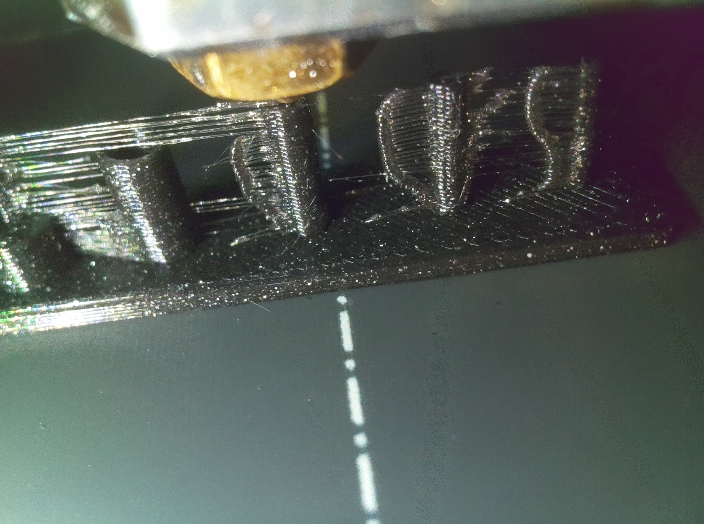
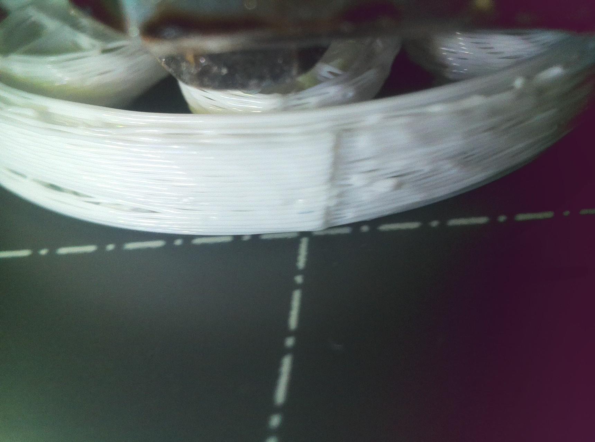
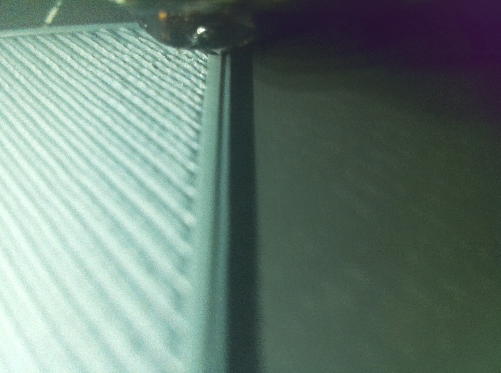
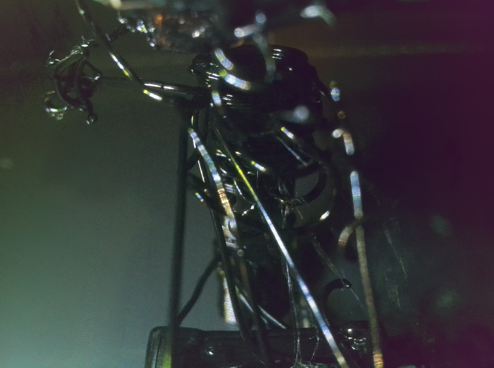
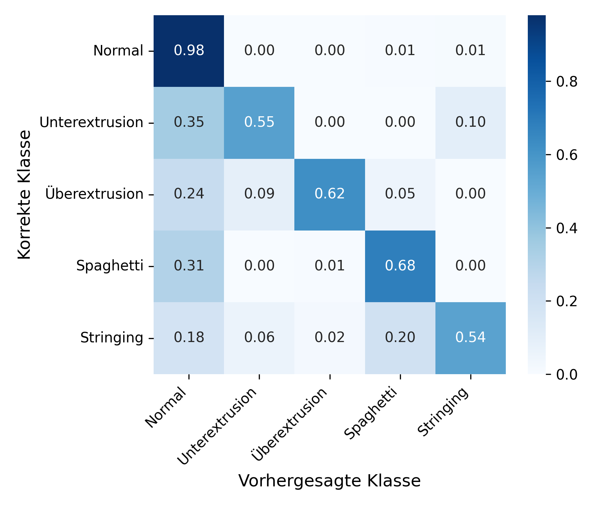
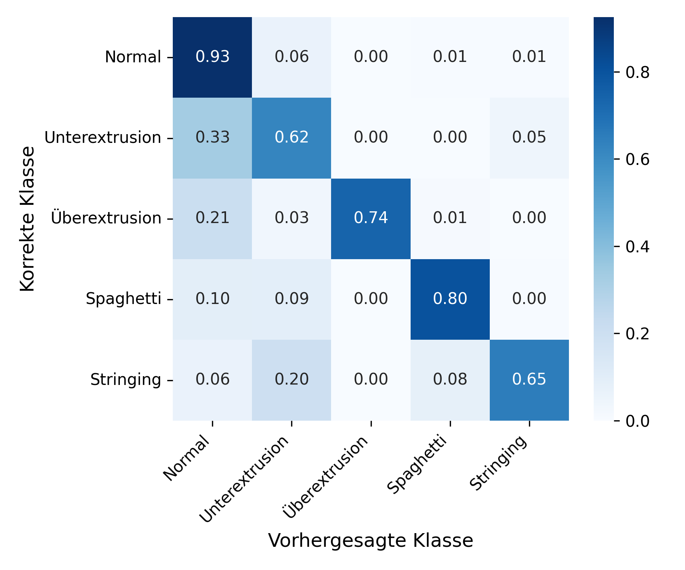

## FDM-Nozzle-Camera-Anomaly-Detection

This project focuses on developing an automated system for identifying anomalies in Fused Deposition Modeling (FDM) 3D prints.

**Key aspects:**

- **FDM Anomaly Detection**: Real-time identification of print defects.
- **Nozzle-Mounted Camera**: Utilized for precise image acquisition.
- **Four Distinct Error Types**: Capability to classify between stringing, underextrusion, overextrusion and spaghetti failure.
- **Extensive Dataset**: Trained, validated and tested on 85,000 images.

## Error Types

The system is capable of detecting and classifying four distinct types of 3D printing anomalies:

- **Stringing**: Thin plastic threads that form between separate parts of a print, typically caused by excessive temperature or improper retraction settings.

  

- **Underextrusion**: Insufficient material flow resulting in gaps, weak layer adhesion, or incomplete infill patterns, often due to clogged nozzles or low flow rates.

  

- **Overextrusion**: Excessive material flow leading to blob formation, rough surface finish, and dimensional inaccuracies, usually caused by high flow rates or temperature settings.

  

- **Spaghetti Failure**: Complete print failure where the print detaches from the bed and creates a tangled mess of filament, typically resulting from poor bed adhesion or layer shifting.

  

## Results

The project evaluates the performance of two models: ResNet50 and ViT-B/16, both trained on the same dataset. The results are presented in terms of accuracy for each class of anomalies, along with confusion matrices to visualize classification performance.

### Resnet50 Model Performance

  

| Class          | Accuracy |
| -------------- | -------- |
| Normal         | 0.98     |
| Unterextrusion | 0.55     |
| Überextrusion  | 0.62     |
| Spaghetti      | 0.68     |
| Stringing      | 0.54     |

 |  |

### Vit-B/16 Model Performance

  

| Class          | Accuracy |
| -------------- | -------- |
| Normal         | 0.93     |
| Unterextrusion | 0.62     |
| Überextrusion  | 0.74     |
| Spaghetti      | 0.80     |
| Stringing      | 0.65     |

  

  

    
  

